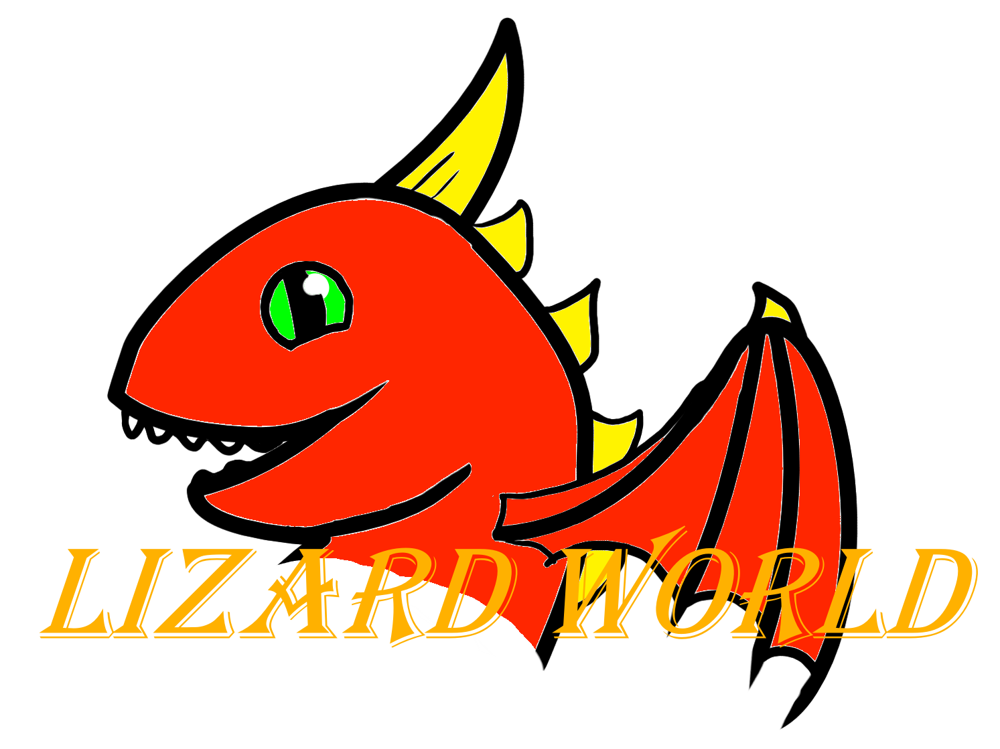

<!-- Improved compatibility of back to top link: See: https://github.com/othneildrew/Best-README-Template/pull/73 -->

[![Contributors][contributors-shield]][contributors-url]
[![Issues][issues-shield]][issues-url]

<!-- PROJECT LOGO -->
 

  

<h3 align="center">Lizard World</h3>

  

    Multiplyer Game writen in Godot. At the Acagamics Summer Gamejam 2023 in Magdeburg.
     
    <a href="https://github.com/janekx21/lizard-world"><strong>Explore the docs »</strong></a>
     
     
    <a href="https://github.com/janekx21/lizard-world">View Demo</a>
    ·
    <a href="https://github.com/janekx21/lizard-world/issues">Report Bug</a>
    ·
    <a href="https://github.com/janekx21/lizard-world/issues">Request Feature</a>
  

<!-- ABOUT THE PROJECT -->
## About The Project

![Product Name Screen Shot][product-screenshot]

(<a href="#readme-top">back to top</a>)

### Built With

[![Godot][Godot]][Godot-url]

(<a href="#readme-top">back to top</a>)

<!-- GETTING STARTED -->
## Getting Started

### Prerequisites

* install Godot

### Run Game

1. Download the Artefacts for your OS from the latest [Action](https://github.com/janekx21/lizard-world/actions)
2. Unpack zipfile
3. Run lizard-world-client.x86_64

(<a href="#readme-top">back to top</a>)

<!-- ROADMAP -->
## Roadmap

- [ ] Boss Fight

See the [open issues](https://github.com/janekx21/lizard-world/issues) for a full list of proposed features (and known issues).

(<a href="#readme-top">back to top</a>)

<!-- CONTRIBUTING -->
## Contributing

Contributions are what make the open source community such an amazing place to learn, inspire, and create. Any contributions you make are **greatly appreciated**.

If you have a suggestion that would make this better, please fork the repo and create a pull request. You can also simply open an issue with the tag "enhancement".
Don't forget to give the project a star! Thanks again!

1. Fork the Project
2. Create your Feature Branch (`git checkout -b feature/AmazingFeature`)
3. Commit your Changes (`git commit -m 'Add some AmazingFeature'`)
4. Push to the Branch (`git push origin feature/AmazingFeature`)
5. Open a Pull Request

(<a href="#readme-top">back to top</a>)

<!-- LICENSE -->
## License

Not decided
<!-- Distributed under the MIT License. See `LICENSE.txt` for more information. -->

(<a href="#readme-top">back to top</a>)

<!-- MARKDOWN LINKS & IMAGES -->
<!-- https://www.markdownguide.org/basic-syntax/#reference-style-links -->
[contributors-shield]: https://img.shields.io/github/contributors/janekx21/lizard-world.svg?style=for-the-badge
[contributors-url]: https://github.com/janekx21/lizard-world/graphs/contributors
[issues-shield]: https://img.shields.io/github/issues/janekx21/lizard-world.svg?style=for-the-badge
[issues-url]: https://github.com/janekx21/lizard-world/issues
[product-screenshot]: screenshots/Screenshot_20230521_174327.png
[Godot]: https://img.shields.io/badge/Godot-202630?style=for-the-badge&logo=godotengine&logoColor=478CBF
[Godot-url]: https://godotengine.org/

